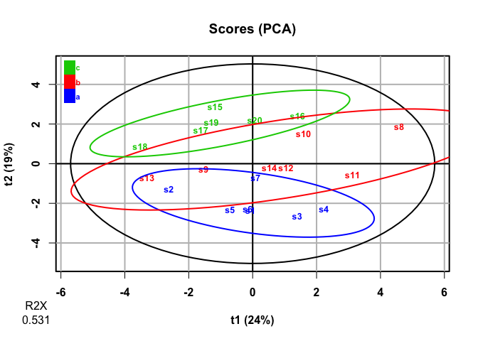
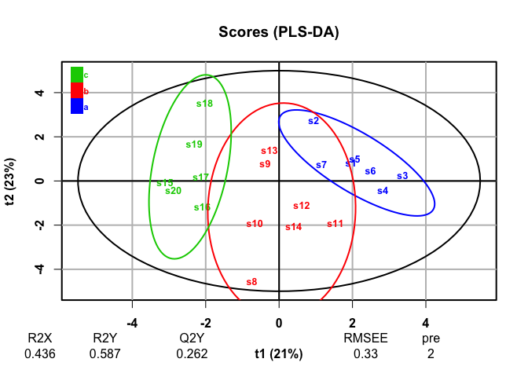

<!-- README.md is generated from README.Rmd. Please edit that file -->

[](https://travis-ci.org/Aariq/holodeck)
[](https://codecov.io/gh/Aariq/holodeck)
[](https://zenodo.org/badge/latestdoi/167047376)
[](https://cran.r-project.org/web/packages/holodeck/index.html)


# holodeck: A Tidy Interface For Simulating Multivariate Data

`holodeck` allows quick and simple creation of simulated multivariate
data with variables that co-vary or discriminate between levels of a
categorical variable. The resulting simulated multivariate dataframes
are useful for testing the performance of multivariate statistical
techniques under different scenarios, power analysis, or just doing a
sanity check when trying out a new multivariate method.

## Installation

From CRAN:

``` r
install.packages("holodeck)
```

Development version:

``` r
# install.packages("remotes")
remotes::install_github("Aariq/holodeck")
```

## Load packages

`holodeck` is built to work with `dplyr` functions, including
`group_by()` and the pipe (`%>%`). `purrr` is helpful for iterating
simulated data. For these examples I’ll use `ropls` for PCA and PLS-DA.

``` r
library(holodeck)
library(dplyr)
library(tibble)
library(purrr)
library(ropls)
```

## Example 1: Investigating PCA and PLS-DA

Let’s say we want to learn more about how principal component analysis
(PCA) works. Specifically, what matters more in terms of creating a
principal component—variance or covariance of variables? To this end,
you might create a dataframe with a few variables with high covariance
and low variance and another set of variables with low covariance and
high variance

### Generate data

``` r
set.seed(925)
df1 <- 
  sim_covar(n_obs = 20, n_vars = 5, cov = 0.9, var = 1, name = "high_cov") %>%
  sim_covar(n_vars = 5, cov = 0.1, var = 2, name = "high_var") 
```

Explore covariance structure visually. The diagonal is variance.

``` r
df1 %>% 
  cov() %>%
  heatmap(Rowv = NA, Colv = NA, symm = TRUE, margins = c(6,6), main = "Covariance")
```


Now let’s make this dataset a little more complex. We can add a factor
variable, some variables that discriminate between the levels of that
factor, and add some missing values.

``` r
set.seed(501)
df2 <-
  df1 %>% 
  sim_cat(n_groups = 3, name = "factor") %>% 
  group_by(factor) %>% 
  sim_discr(n_vars = 5, var = 1, cov = 0, group_means = c(-1.3, 0, 1.3), name = "discr") %>% 
  sim_discr(n_vars = 5, var = 1, cov = 0, group_means = c(0, 0.5, 1), name = "discr2") %>% 
  sim_missing(prop = 0.1) %>% 
  ungroup()
df2
#> # A tibble: 20 x 21
#>    factor high_cov_1 high_cov_2 high_cov_3 high_cov_4 high_cov_5 high_var_1
#>    <chr>       <dbl>      <dbl>      <dbl>      <dbl>      <dbl>      <dbl>
#>  1 a           0.472   -0.362       0.253      0.281       0.247    -1.54  
#>  2 a          -1.50    -1.65       NA         -1.93       -1.27      1.00  
#>  3 a           1.13     0.655       0.980      1.41        0.345    -1.90  
#>  4 a           0.982    0.740       1.16       1.14        0.866     1.71  
#>  5 a          -0.773   NA          -1.22      -1.21       -1.25     -0.576 
#>  6 a           0.302    0.130      -0.309      0.0725     NA        NA     
#>  7 a          -0.117    0.00163     0.0596    -0.542      -0.269     2.87  
#>  8 b           2.16     2.47       NA          1.62       NA         0.146 
#>  9 b          -0.268   -0.509      -0.529     -0.842      -1.04     NA     
#> 10 b           0.609    0.195       0.720      0.930       0.595     0.0765
#> 11 b           1.81    NA           1.43       1.09        1.39     -0.927 
#> 12 b           0.954    0.234       0.247      0.248       0.751     2.77  
#> 13 b          -1.03    -1.24       -1.70      NA          -1.64      1.34  
#> 14 b          -0.180    0.380       0.177      0.433       0.550     1.20  
#> 15 c          -0.214   -0.390      -0.476     -0.878      -0.328     3.18  
#> 16 c           0.827    0.556       0.620      0.491      NA         1.91  
#> 17 c          -0.399   -0.862      -0.385     -0.935      -0.802    -0.787 
#> 18 c          -1.09    -1.32       -0.720     NA          -1.76     -1.76  
#> 19 c          -0.181   -0.155      -0.774      0.0395     -0.770     0.741 
#> 20 c           0.882   NA           0.758      1.24        0.838     0.182 
#> # … with 14 more variables: high_var_2 <dbl>, high_var_3 <dbl>,
#> #   high_var_4 <dbl>, high_var_5 <dbl>, discr_1 <dbl>, discr_2 <dbl>,
#> #   discr_3 <dbl>, discr_4 <dbl>, discr_5 <dbl>, discr2_1 <dbl>,
#> #   discr2_2 <dbl>, discr2_3 <dbl>, discr2_4 <dbl>, discr2_5 <dbl>
```

### PCA

``` r
pca <- opls(select(df2, -factor), printL = FALSE, plotL = FALSE)
#> Warning: 'printL' argument is deprecated; use 'info.txtC' instead
#> Warning: 'plotL' argument is deprecated; use 'fig.pdfC' instead
  
plot(pca, parAsColFcVn = df2$factor, typeVc = "x-score")
#> Warning: Character 'parAsColFcVn' set to a factor
```



``` r

getLoadingMN(pca) %>%
  as_tibble(rownames = "variable") %>% 
  arrange(desc(abs(p1)))
#> # A tibble: 20 x 4
#>    variable         p1      p2       p3
#>    <chr>         <dbl>   <dbl>    <dbl>
#>  1 high_cov_1  0.377    0.194   0.0800 
#>  2 high_cov_4  0.375    0.215   0.0202 
#>  3 high_cov_3  0.368    0.225   0.133  
#>  4 high_cov_5  0.362    0.186  -0.0539 
#>  5 high_cov_2  0.348    0.227   0.0108 
#>  6 discr_1    -0.306    0.219   0.0135 
#>  7 discr2_1    0.290    0.0895 -0.322  
#>  8 discr_4    -0.220    0.329  -0.120  
#>  9 high_var_3  0.169   -0.142   0.184  
#> 10 discr_3    -0.157    0.324  -0.176  
#> 11 discr2_5   -0.153    0.242   0.318  
#> 12 discr_2    -0.116    0.350  -0.210  
#> 13 discr2_4   -0.0572   0.212   0.292  
#> 14 discr2_2    0.0518  -0.133  -0.0374 
#> 15 discr2_3   -0.0513   0.0717  0.00649
#> 16 high_var_2 -0.0512  -0.0938 -0.442  
#> 17 discr_5    -0.0448   0.424  -0.0118 
#> 18 high_var_4 -0.0236   0.220   0.0444 
#> 19 high_var_5  0.00619  0.0503 -0.434  
#> 20 high_var_1 -0.00483 -0.0231 -0.414
```

It looks like PCA mostly picks up on the variables with high covariance,
**not** the variables that discriminate among levels of `factor`. This
makes sense, as PCA is an unsupervised
analysis.

### PLS-DA

``` r
plsda <- opls(select(df2, -factor), df2$factor, printL = FALSE, plotL = FALSE, predI = 2)
#> Warning: 'printL' argument is deprecated; use 'info.txtC' instead
#> Warning: 'plotL' argument is deprecated; use 'fig.pdfC' instead

plot(plsda, typeVc = "x-score")
```



``` r

getVipVn(plsda) %>% 
  tibble::enframe(name = "variable", value = "VIP") %>% 
  arrange(desc(VIP))
#> # A tibble: 20 x 2
#>    variable     VIP
#>    <chr>      <dbl>
#>  1 discr_5    1.73 
#>  2 discr_2    1.66 
#>  3 discr_4    1.56 
#>  4 discr_3    1.51 
#>  5 discr_1    1.46 
#>  6 discr2_5   1.06 
#>  7 discr2_3   0.986
#>  8 discr2_4   0.935
#>  9 high_cov_4 0.817
#> 10 high_cov_2 0.749
#> 11 high_cov_1 0.734
#> 12 high_var_3 0.725
#> 13 discr2_2   0.702
#> 14 high_var_4 0.697
#> 15 high_cov_5 0.671
#> 16 discr2_1   0.629
#> 17 high_cov_3 0.328
#> 18 high_var_1 0.327
#> 19 high_var_5 0.276
#> 20 high_var_2 0.199
```

PLS-DA, a supervised analysis, finds discrimination among groups and
finds that the discriminating variables we generated are most
responsible for those differences.
