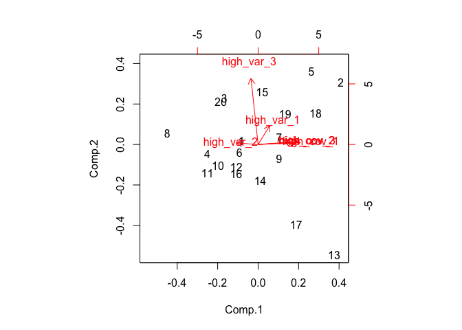

<!-- README.md is generated from README.Rmd. Please edit that file -->

# tidymvsim

`tidymvsim` allows quick and simple creation of simulated multivariate
data with variables that co-vary or discriminate between levels of a
categorical variable. The resulting simulated multivariate dataframes
are useful for testing the performance of multivariate statistical
techniques under different scenarios, power analysis, and more\!

## Installation

`tidymvsim` is currently not on CRAN, but you can install it from github
with the following R code:

``` r
# install.packages("devtools")
devtools::install_github("Aariq/tidymvsim")
```

## Load packages

`tidymvsim` is built to work with `dplyr` functions, including the pipe
(`%>%`)

``` r
library(tidymvsim)
library(dplyr)
```

## Example 1: Investigating PCA

Let’s say we want to learn more about how principal component analysis
(PCA) works. Specifically, what matters more in terms of creating a
principal component—variance or covariance of variables? To this end,
you might create a dataframe with a few variables with high covariance
and low variance and another set of variables with low covariance and
high variance

``` r
set.seed(925)
df1 <- 
  sim_covar(N = 20, p = 3, cov = 0.9, var = 1, name = "high_cov") %>%
  sim_covar(p = 3, cov = 0.1, var = 2, name = "high_var") 
```

Explore correlation structure visually.

``` r
plot(df1)
```


And do PCA

``` r
df1.pca <- princomp(df1)
loadings(df1.pca)
#> 
#> Loadings:
#>            Comp.1 Comp.2 Comp.3 Comp.4 Comp.5 Comp.6
#> high_cov_1  0.568                0.273  0.676  0.378
#> high_cov_2  0.522         0.177  0.113        -0.825
#> high_cov_3  0.532                0.130 -0.731  0.402
#> high_var_1  0.157  0.274  0.492 -0.800         0.105
#> high_var_2 -0.296         0.831  0.464              
#> high_var_3         0.959 -0.171  0.201              
#> 
#>                Comp.1 Comp.2 Comp.3 Comp.4 Comp.5 Comp.6
#> SS loadings     1.000  1.000  1.000  1.000  1.000  1.000
#> Proportion Var  0.167  0.167  0.167  0.167  0.167  0.167
#> Cumulative Var  0.167  0.333  0.500  0.667  0.833  1.000
biplot(df1.pca)
```



It looks like the variables with high covariance and low variance load
most strongly on the first PC.

## Example 2: Effect of missing data

What’s the effect of missing data on a statistical analysis? The
`sim_missing()` function replaces a proportion of values with NA. Let’s
see how it affects a PERMANOVA.

### Create datasets

We can chain several `sim_*` functions to quickly create a dataframe.

``` r
df2 <- 
  sim_cat(N = 25, n_groups = 3, name = "factor") %>% 
  sim_covar(p = 3, var = 1, cov = 0.0, name = "noise") %>% 
  group_by(factor) %>% 
  sim_discr(p = 3, var = 1, cov = 0, group_means = c(-1.5, 0, 1.5), name  = "signal")
df2
#> # A tibble: 25 x 7
#> # Groups:   factor [3]
#>    factor noise_1 noise_2 noise_3 signal_1 signal_2 signal_3
#>    <chr>    <dbl>   <dbl>   <dbl>    <dbl>    <dbl>    <dbl>
#>  1 a      -1.03    0.444    0.978   -3.13    -1.77    -1.77 
#>  2 a       0.647  -0.354   -0.963   -1.14    -1.62    -2.38 
#>  3 a      -0.0868 -0.375   -1.93    -0.423    0.123   -0.576
#>  4 a      -1.41   -1.18    -0.773   -2.11    -0.793   -1.65 
#>  5 a       1.05    0.307   -0.692   -0.220   -0.826   -1.96 
#>  6 a       1.15    0.191   -0.193   -1.62    -2.89    -0.972
#>  7 a      -0.0616  1.60     1.84    -1.15    -2.39    -0.284
#>  8 a      -0.0326  0.882    0.549   -1.55    -2.94    -0.530
#>  9 a      -1.02    0.530    1.10    -3.67    -0.791   -1.62 
#> 10 b       0.154  -0.0768  -0.338    0.254    0.677   -0.283
#> # … with 15 more rows
```

We can then use `map()` from the `purrr` package to create many randomly
generated datasets using the same specifications, with and without
missing values.

``` r
library(purrr)
#> Warning: package 'purrr' was built under R version 3.5.2
```

``` r
set.seed(100)
dfs <-
  map(1:20, 
      ~sim_cat(N = 40, n_groups = 3, name = "factor") %>% 
        sim_covar(p = 3, var = 1, cov = 0.0, name = "noise") %>% 
        group_by(factor) %>% 
        sim_discr(p = 3, var = 1, cov = 0, group_means = c(-0.5, 0, 0.5), name  = "signal") %>% 
        ungroup())
```

### Simulate missing data

We can now map the `sim_missing()` function to randomly introduce NAs to
the datasets.

``` r
set.seed(100)
dfs.missing <-
  map(dfs, ~sim_missing(., prop = 0.2))
```

And finally, deal with those NAs with multiple imputation with the
`mice` package

``` r
library(mice)
#> Loading required package: lattice
#> 
#> Attaching package: 'mice'
#> The following objects are masked from 'package:base':
#> 
#>     cbind, rbind
# this might take a few seconds
dfs.imputed <-
  map(dfs.missing, ~mice(., printFlag = FALSE) %>% complete())
```

Here, we can compare an example dataset as original, with NAs, and
imputed:

``` r
head(dfs[[1]])
#> # A tibble: 6 x 7
#>   factor noise_1 noise_2 noise_3 signal_1 signal_2 signal_3
#>   <chr>    <dbl>   <dbl>   <dbl>    <dbl>    <dbl>    <dbl>
#> 1 a       -1.69    0.236  -1.09    -0.498   -1.37    0.557 
#> 2 a        0.166   0.307  -0.968   -0.180    0.316  -0.704 
#> 3 a       -0.230   0.744   0.949   -1.96    -1.19    1.33  
#> 4 a       -1.55   -0.111   2.62    -1.36    -0.234   0.707 
#> 5 a        0.639   0.801  -2.89    -0.867   -1.29   -0.332 
#> 6 a        0.997   0.446  -1.85    -0.902   -0.341   0.0175
head(dfs.missing[[1]])
#> # A tibble: 6 x 7
#>   factor noise_1 noise_2 noise_3 signal_1 signal_2 signal_3
#>   <chr>    <dbl>   <dbl>   <dbl>    <dbl>    <dbl>    <dbl>
#> 1 a       NA      NA      -1.09    -0.498   NA       0.557 
#> 2 a        0.166   0.307  -0.968   -0.180    0.316  -0.704 
#> 3 a       NA       0.744   0.949   -1.96    -1.19    1.33  
#> 4 a       -1.55   -0.111   2.62    -1.36    -0.234   0.707 
#> 5 a        0.639   0.801  -2.89    -0.867   NA      -0.332 
#> 6 a        0.997   0.446  -1.85    -0.902   -0.341   0.0175
head(dfs.imputed[[1]])
#>   factor    noise_1    noise_2    noise_3   signal_1   signal_2
#> 1      a -0.1257547  0.8013671 -1.0852542 -0.4981282  0.8973459
#> 2      a  0.1657635  0.3070560 -0.9680104 -0.1795347  0.3160598
#> 3      a  0.3738299  0.7444634  0.9490844 -1.9590652 -1.1913561
#> 4      a -1.5515005 -0.1112986  2.6246159 -1.3565607 -0.2342102
#> 5      a  0.6387119  0.8013671 -2.8872108 -0.8670493 -0.3410057
#> 6      a  0.9972444  0.4459734 -1.8517622 -0.9024310 -0.3410057
#>      signal_3
#> 1  0.55695263
#> 2 -0.70440247
#> 3  1.33017336
#> 4  0.70676473
#> 5 -0.33178566
#> 6  0.01747177
```

### Analyze

Then we could run PERMANOVAs on each dataset and compare the mean
p-values to get an idea how how missing values affect the power of the
test.

``` r
library(vegan)
#> Warning: package 'vegan' was built under R version 3.5.2
#> Loading required package: permute
#> This is vegan 2.5-4
ps <- 
  map_dbl(dfs,
          ~adonis(select(.,-factor) ~ factor, data = ., method = "eu")$aov.tab$`Pr(>F)`[1])

ps.imputed <- 
  map_dbl(dfs.imputed,
          ~adonis(select(.,-factor) ~ factor, data = ., method = "eu")$aov.tab$`Pr(>F)`[1])

tibble(ps, ps.imputed) %>% 
  summarize_all(mean, na.rm = TRUE)
#> # A tibble: 1 x 2
#>       ps ps.imputed
#>    <dbl>      <dbl>
#> 1 0.0384      0.130
```
